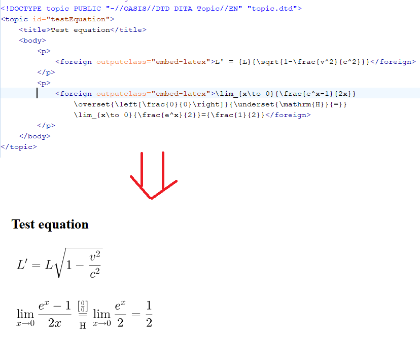

# dita-latex
DITA Open Toolkit plugin which allows publishing embedded Latex mathematical equations to HTML and PDF.

The plugin was tested and developed with DITA OT 3.2.1.

If you set the @outputclass="embed-latex" attribute on a DITA <foreign> element the plugin will attempt to convert it to SVG.
The "samples" folder contains a sample DITA topic with a Latex equation which is properly displayed when converted to HTML and PDF-based outputs.
  

## Installation steps

- Download a zip containing the entire project: https://github.com/oxygenxml/dita-latex/archive/refs/heads/master.zip
- Unzip and copy the sub-folder **com.oxygenxml.latex.svg** to the **DITA-OT\plugins** installation folder. If you are using the DITA OT bundled with Oxygen, it is located in the **OXYGEN_INSTALL_DIR/frameworks/dita/DITA-OT3.x** folder.
- Install the DITA OT plugin running the **DITA-OT\bin\dita --install** command.
  
Copyright and License
---------------------
Copyright 2019 Syncro Soft SRL.

This project is licensed under [Apache License 2.0](https://github.com/oxygenxml/dita-latex/blob/master/LICENSE).
The plugin contains a Java library provided by the JLatexMath under the GNU General Public License v2.0 w/Classpath exception license: https://github.com/opencollab/jlatexmath/blob/master/LICENSE
